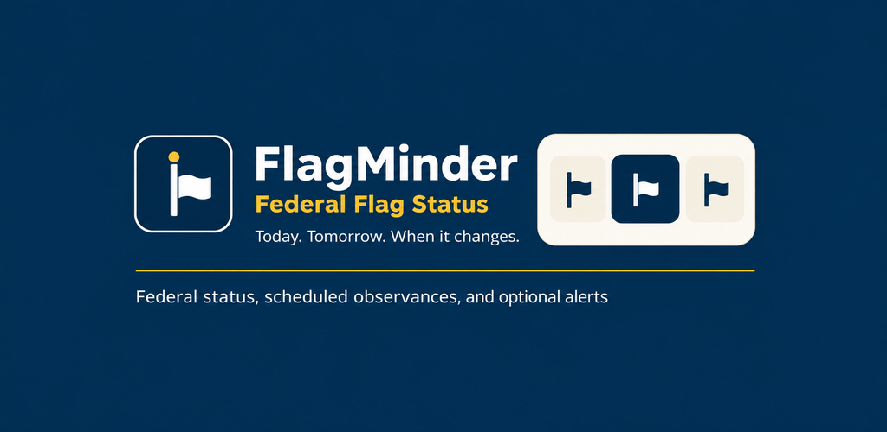
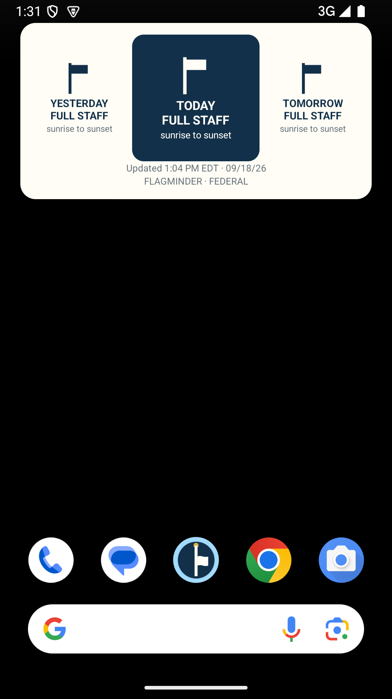
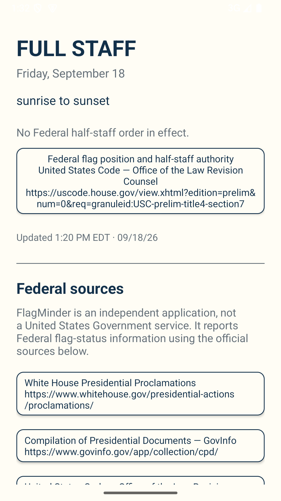
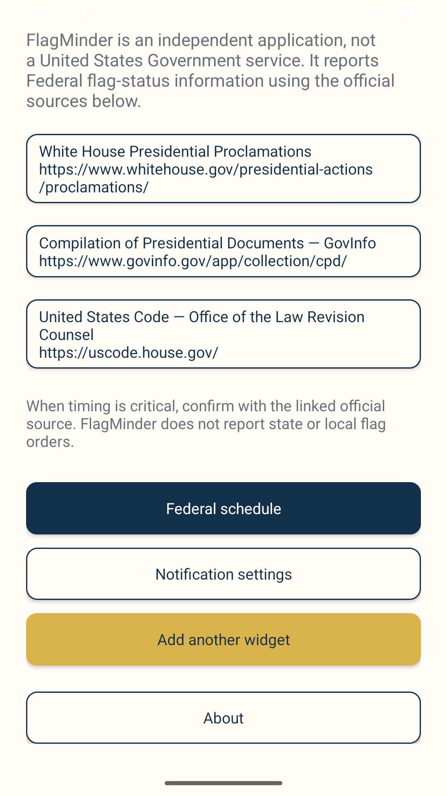
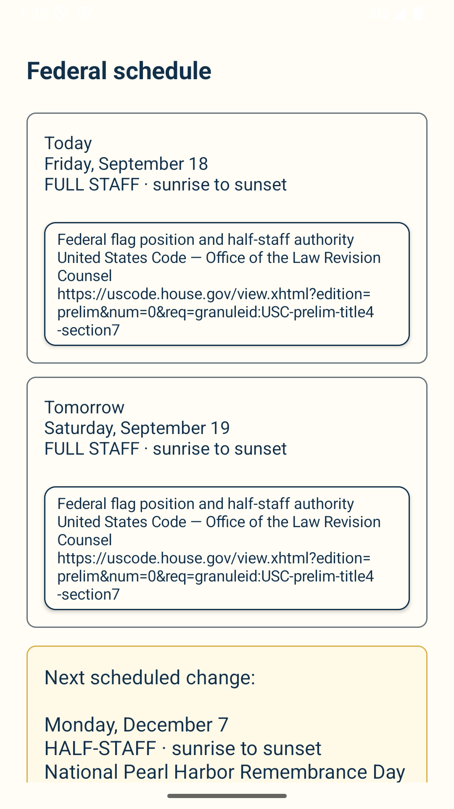
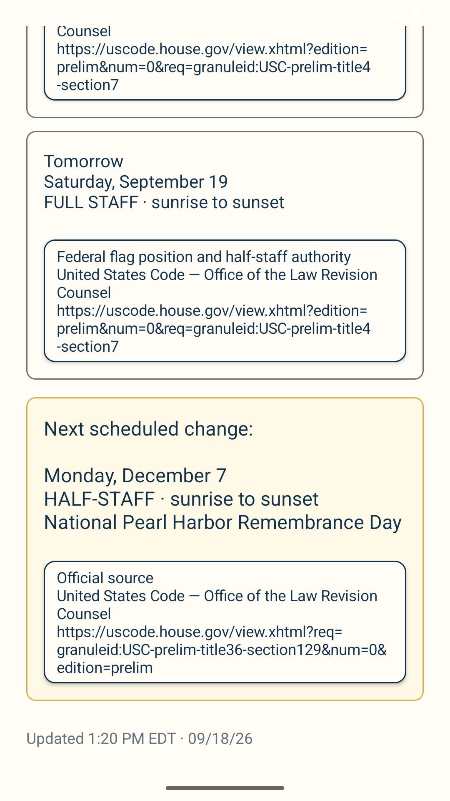
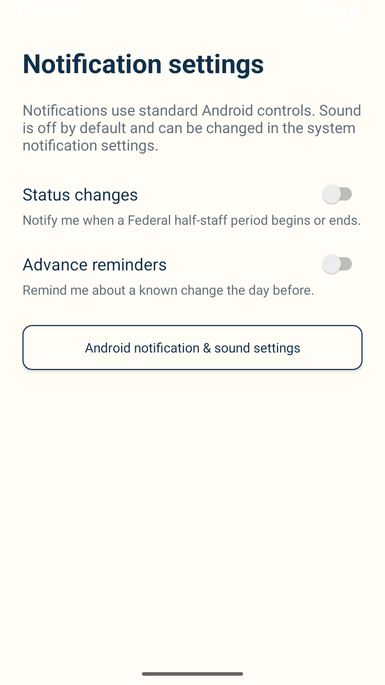
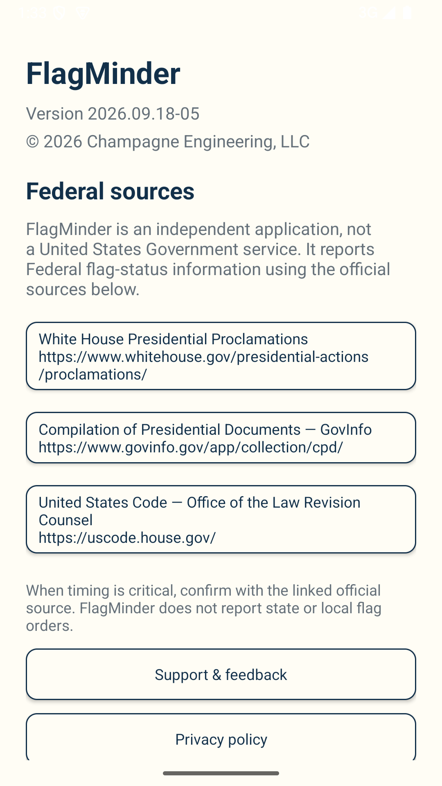

# FlagMinder

**Status:** Production 
**Platform:** Android 
**Current version:** `2026.09.18-05`

Android package: `engineering.champagne.flagminder`

## Overview

FlagMinder is a Federal U.S. flag-status indicator. It combines scheduled
Federal observances with Presidential half-staff actions after they are
received and processed from official Federal sources. Its home-screen widget
shows yesterday, today, and tomorrow so a change in flag position is visible
at a glance. The app provides the effective time, reason, official source,
upcoming Federal observances, and optional local notifications.

## Features

- Resizable home-screen widget with Yesterday / Today / Tomorrow context
- Full-staff and half-staff timelines, including partial-day transitions
- Current Federal status with effective time and official-source links
- Upcoming scheduled Federal flag-status observances
- Optional local notifications for status changes and advance reminders
- Cached current status with visible freshness information
- No account, location permission, or state selection

## Screenshots

  
  
  
  
  
  
  

## Repository Purpose

This public repository contains FlagMinder documentation, release notes, store
graphics, screenshots, and issue-tracking material. It does not contain the
Android application source code or backend implementation.

## Resources

- [Release Notes](docs/release-notes.md)
- [Documentation](docs/README.md)
- [Google Play](https://play.google.com/store/apps/details?id=engineering.champagne.flagminder)
- [FlagMinder product page](https://champagne.engineering/flagminder)
- [Privacy Policy](https://champagne.engineering/privacy)
- [Terms of Service](https://champagne.engineering/tos)

## Support

Website: https://champagne.engineering 
Email: support@champagne.engineering

## Important Notice

FlagMinder reports Federal U.S. flag status only. It does not report state,
local, organizational, or property-specific requirements. Status information
may become stale during a connectivity or source-processing interruption; when
timing is critical, confirm with the linked official source.

## Copyright

© 2026 Champagne Engineering, LLC. All rights reserved.

FlagMinder is an independent application developed under the CE Widgets brand
by Champagne Engineering, LLC.
